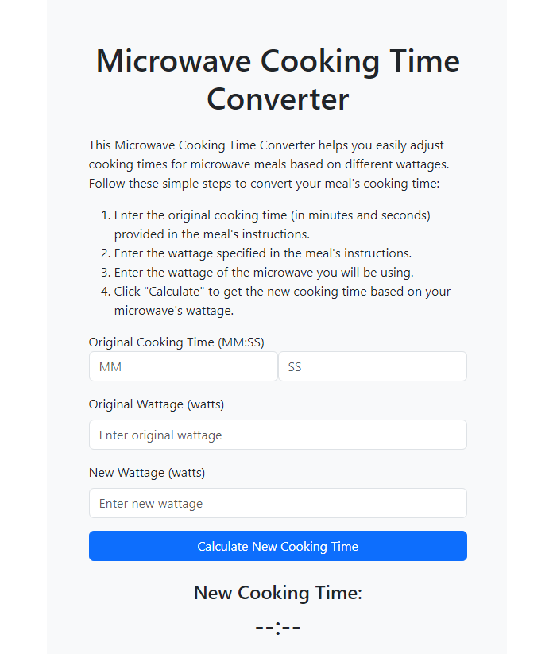

# Microwave Cooking Time Converter

Microwave Cooking Time Converter is a simple web app that helps users convert cooking times for microwave meals based on different wattages. If a meal's cooking instructions specify a certain cooking time for a specific wattage, this app will help users find the appropriate cooking time for their microwave with a different wattage.

  

## Features

- User-friendly interface with input fields for original cooking time, original wattage, and new wattage
- Calculates the new cooking time based on the provided values and displays the result in minutes and seconds format (MM:SS)
- Mobile-responsive design using Bootstrap

## Technologies Used

- HTML5
- CSS3
- JavaScript
- Bootstrap 5

## Getting Started

To use the Microwave Cooking Time Converter web app, simply clone or download the repository, and open the `index.html` file in your favorite web browser.

## Contributing

If you'd like to contribute to this project, please feel free to submit a pull request or open an issue for discussion.

## License

This project is licensed under the MIT License. See the `LICENSE` file for more information.
